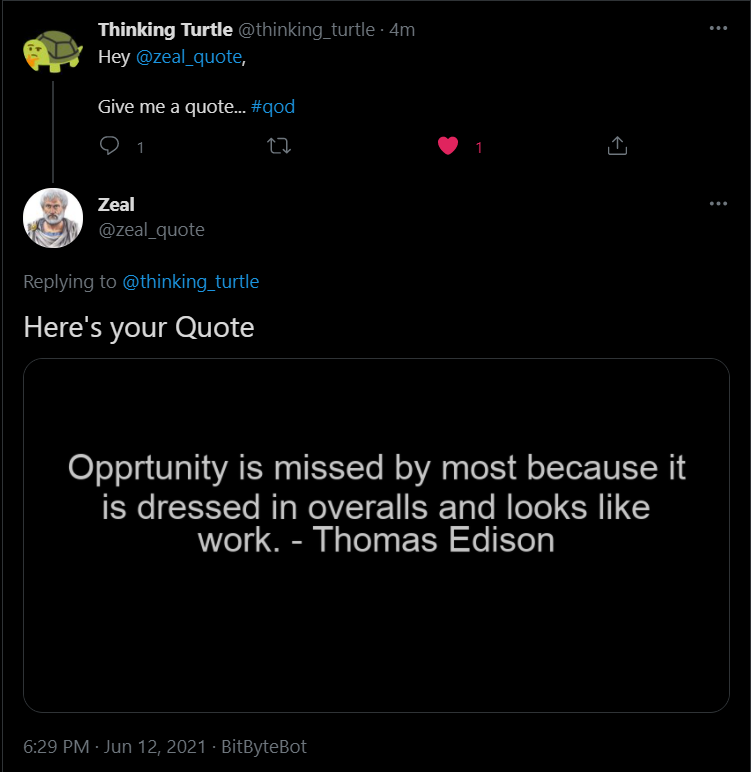

# Pytweet
Twitter Bot made using Tweepy in Python

**TL;DR:**

The bot will reply to every tweet in which it got mentioned with a specific keyword. The reply will be in the form of an image with a quote written on it.

checkout [@Zeal_Quote](https://twitter.com/zeal_quote)

Here's the complete link for the article, explaining each and every step - https://auth0.com/blog/how-to-make-a-twitter-bot-in-python-using-tweepy/
